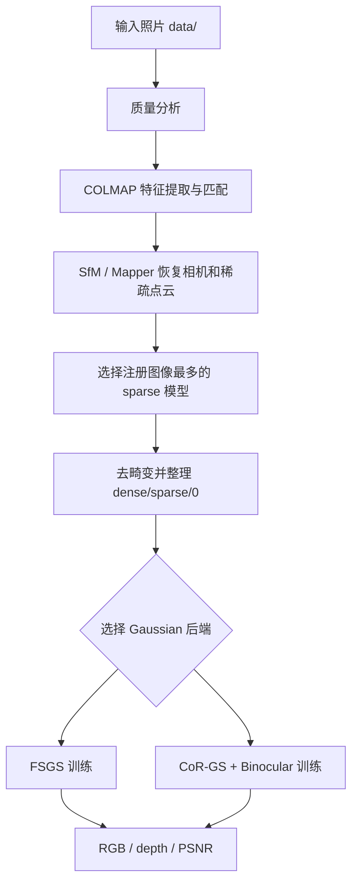

# SparseView3DGS 程序流程与使用说明

本项目将工作内容分为三个根目录：`data/` 保存输入和训练数据，`program/` 保存程序与依赖，`output/` 保存所有重建、模型和渲染结果。默认使用 conda `ai` 环境，不重复创建环境，也不删除已下载的软件包。

## 1. 总体流程



COLMAP 主要完成 SfM：估计相机内外参、匹配图像并生成稀疏点云。FSGS、CoR-GS 和 Binocular Stereo Consistency 在此基础上训练 Gaussian 参数，二者不是同一个阶段。

## 2. 项目结构

```text
SparseView3DGS/
├─ data/                         # 输入照片和可复用训练数据
│  ├─ *.jpg                      # 当前原始照片
│  ├─ fsgs/                      # FSGS/CoR-GS 可直接读取的数据集
│  └─ processed/                 # 统一分辨率等处理后的历史副本
├─ program/                      # 程序、后端、CUDA 扩展和 COLMAP
│  ├─ sparseview3dgs/            # 图片分析、COLMAP 和交互查看器
│  ├─ scripts/                   # 唯一保留的 Python 入口
│  ├─ fsgs/                      # FSGS 后端及 CUDA 扩展
│  ├─ corgs/                     # CoR-GS 后端及 CUDA 扩展
│  └─ colmap-x64-windows-cuda/   # 已下载的 COLMAP
└─ output/                       # 所有输出
   ├─ reconstruction/            # COLMAP 中间结果和后端输入
   ├─ fsgs/                      # FSGS 模型、日志和渲染
   └─ corgs/                     # CoR-GS 模型、日志和渲染
```

后端数据集必须包含：

```text
dataset/
├─ images/
└─ sparse/0/
   ├─ cameras.bin
   ├─ images.bin
   └─ points3D.bin
```

## 3. 统一入口

所有命令从项目根目录执行。以下示例使用 conda `ai` 环境中的 Python：

```powershell
cd C:\mine\git\SparseView3DGS
```

使用的 Python：

```powershell
$python = 'C:\Users\leo\.conda\envs\ai\python.exe'
```

### 3.1 分析图片

```powershell
python .\program\scripts\run_pipeline.py \
  --stage analyze \
  --images .\data \
  --workspace .\output\reconstruction\analysis_latest
```

报告位置：`output/reconstruction/analysis_latest/reports/image_quality.json`。模糊度只能作为筛选指标，还需要结合 COLMAP 注册数量、相机轨迹和重投影误差判断异常图片。

### 3.2 运行 COLMAP 并准备后端数据

```powershell
python .\program\scripts\run_pipeline.py \
  --stage prepare \
  --images .\data \
  --workspace .\output\reconstruction\recon_latest \
  --config .\config.yaml
```

程序依次执行图片分析、特征提取、exhaustive matching、mapper、sparse 模型统计、去畸变，并将最佳模型整理到 `output/reconstruction/recon_latest/dense/sparse/0`。选择信息保存在 `manifest.json`。

如果需要手动指定 sparse 模型：

```powershell
$env:PYTHONPATH = (Resolve-Path .\program).Path
& C:\Users\leo\.conda\envs\ai\python.exe `
  -m sparseview3dgs.prepare `
  --images .\data `
  --workspace .\output\reconstruction\recon_latest `
  --config .\config.yaml `
  --colmap .\program\colmap-x64-windows-cuda\bin\colmap.exe `
  --sparse-model 1
```

### 3.3 FSGS 训练

```powershell
python .\program\scripts\run_pipeline.py \
  --stage train \
  --method fsgs \
  --dataset .\output\reconstruction\recon_latest\dense \
  --model-path .\output\fsgs\fsgs_latest \
  --iterations 4000
```

### 3.4 CoR-GS + Binocular Stereo Consistency 训练

```powershell
python .\program\scripts\run_pipeline.py \
  --stage train \
  --method corgs \
  --dataset .\output\reconstruction\recon_latest\dense \
  --model-path .\output\corgs\corgs_latest \
  --iterations 4000
```

当前包装器默认启用 `--gaussiansN 2`、`--coreg`、`--coprune`、伪视图一致性、Binocular 一致性和周期暂停检查点。Binocular 应在相机尺度和 baseline 合理时启用；它不能修复错误的 COLMAP 位姿。

### 3.5 暂停和断点恢复

训练会周期性写入 `pause_latest.pth`。恢复时使用新模型目录，保留原实验：

```powershell
python .\program\scripts\run_pipeline.py \
  --stage resume \
  --method corgs \
  --dataset .\output\reconstruction\recon_latest\dense \
  --model-path .\output\corgs\corgs_resume_6000 \
  --start-checkpoint .\output\corgs\corgs_latest\pause_latest.pth \
  --iterations 6000
```

### 3.6 渲染

渲染全部训练视角：

```powershell
python .\program\scripts\run_pipeline.py \
  --stage render \
  --method corgs \
  --dataset .\output\reconstruction\recon_latest\dense \
  --model-path .\output\corgs\corgs_latest \
  --iterations 4000 \
  --render-depth
```

只渲染指定视角：

```powershell
python .\render.py \
  --method corgs \
  --dataset .\data\fsgs\latest_18_new_uniform_single_views \
  --model-path .\output\corgs\latest_18_new_cor_gs_binocular_uniform_single_4000 \
  --iteration 4000 \
  --views view_018,view_026,view_035 \
  --render-depth
```

结果位于 `<model>/train/ours_<iteration>/renders/`。

### 3.7 交互式自由选择视角

```powershell
python .\program\scripts\run_pipeline.py \
  --stage interactive \
  --method corgs \
  --dataset .\data\fsgs\latest_18_new_uniform_single_views \
  --model-path .\output\corgs\latest_18_new_cor_gs_binocular_uniform_single_4000 \
  --iterations 4000 \
  --display-scale 0.75
```

鼠标左键旋转、右键平移、滚轮缩放；`R` 重置，`S` 保存当前 RGB 和相机位姿 JSON，`Q` 或 `Esc` 退出。结果保存到 `<model>/interactive/`。

### 3.8 一键流程

新实验可以一次完成分析、COLMAP、训练和渲染：

```powershell
python .\program\scripts\run_pipeline.py \
  --stage all \
  --method corgs \
  --images .\data \
  --workspace .\output\reconstruction\experiment_001 \
  --model-path .\output\corgs\experiment_001_corgs_4000 \
  --iterations 4000 \
  --render-depth
```

## 4. 输出组织约定

每个实验使用独立目录：

```text
output/
├─ reconstruction/experiment_001/
│  ├─ reports/
│  ├─ database.db
│  ├─ sparse/
│  ├─ dense/images/
│  ├─ dense/sparse/0/
│  └─ manifest.json
├─ fsgs/experiment_001_fsgs_4000/
└─ corgs/experiment_001_corgs_4000/
   ├─ cfg_args
   ├─ pause_latest.pth
   ├─ point_cloud/iteration_4000/
   └─ train/ours_4000/renders/
```

不要把新训练结果直接写入旧模型目录。这样可以保留异常实验，便于比较 PSNR、渲染图、Gaussian 数量和中间检查点。

## 5. 当前最佳结果

当前记录较好的结果是 18 张统一分辨率图片、共享 `OPENCV` 内参、CoR-GS + Binocular，4000 次迭代，训练视角平均 PSNR 约 `33.021 dB`：

- 模型：`output/corgs/latest_18_new_cor_gs_binocular_uniform_single_4000`
- 训练记录：[training_results.md](C:/mine/git/SparseView3DGS/training_results.md)
- 示例渲染：`train/ours_4000/renders/`

训练视角 PSNR 不等于新视角泛化质量，应保留未参与训练的图片进行评估。

## 6. 少视图质量要求

- 小物体建议 8–12 张连续环绕照片；只做三张照片之间的插值时，三张都必须成功注册。
- 相邻照片保持约 60%–80% 重叠并具有适度视差。
- 场景静止，曝光、白平衡、焦距和变焦保持一致。
- 统一图片分辨率和宽高比，使用共享内参；不要把不同相机或不同拍摄批次直接混合。
- 训练前检查 `manifest.json`、相机轨迹、重投影误差和 sparse 点云覆盖范围。
- FSGS 主要缓解 SfM 初始 Gaussian 过少；CoR-GS 抑制少视图过拟合；Binocular 提供局部几何一致性。它们都不能修复错误的 SfM 位姿或缺失的真实视角。

## 7. 文件职责与验证

| 文件 | 职责 |
|---|---|
| `program/sparseview3dgs/prepare.py` | 图片质量分析、COLMAP 调用、sparse 模型选择、去畸变和后端目录整理 |
| `program/sparseview3dgs/interactive_viewer.py` | 鼠标控制的自由视角查看和保存 |
| `program/scripts/run_pipeline.py` | 分析、准备、训练、续训、渲染和交互入口 |
| `train.py` | 项目根目录训练入口 |
| `render.py` | 项目根目录指定视角和交互渲染入口 |
| `program/fsgs/train.py` | FSGS 后端训练 |
| `program/corgs/train.py` | CoR-GS、Co-Pruning、伪视图和 Binocular 训练 |
| `program/*/render.py` | RGB、深度图和指定视角渲染 |
| `training_results.md` | 历史实验、问题分析和定量结果 |

验证命令：

```powershell
& C:\Users\leo\.conda\envs\ai\python.exe -m py_compile `
  program\sparseview3dgs\prepare.py `
  program\sparseview3dgs\interactive_viewer.py `
  program\fsgs\render.py `
  program\corgs\render.py
```

```powershell
$env:PYTHONPATH = (Resolve-Path .\program).Path
& C:\Users\leo\.conda\envs\ai\python.exe `
  -m sparseview3dgs.prepare `
  --images .\data `
  --workspace .\output\reconstruction\analysis_smoke `
  --config .\config.yaml `
  --analyze-only
```

## 当前模型目录

统一入口默认使用项目根目录下的 `model/` 作为当前模型目录：

- `--stage train`：训练结果默认保存到 `model/`
- `--stage render`：默认从 `model/` 读取模型
- `--stage interactive`：默认从 `model/` 读取模型
- `render.py`：省略 `--model-path` 时默认读取 `model/`

训练时如果省略 `--dataset`，程序会默认使用项目根目录的 `data/` 作为原始照片目录，先执行 COLMAP 准备，再开始 Gaussian Splatting 训练。准备后的数据保存到默认工作区的 `output/reconstruction/pipeline/dense/`。

因此修改 `data/` 中的照片后，可以直接运行：

```powershell
& C:\Users\leo\.conda\envs\ai\python.exe `
  .\program\scripts\run_pipeline.py `
  --stage train `
  --method corgs `
  --iterations 4000
```

渲染和自由视角查看在省略 `--dataset` 时，默认读取上一次准备生成的 `output/reconstruction/pipeline/dense/`。如果手动指定 `--dataset`，则不会自动执行 COLMAP 准备。

例如：

```powershell
& C:\Users\leo\.conda\envs\ai\python.exe `
  .\program\scripts\run_pipeline.py `
  --stage train `
  --method corgs `
  --iterations 4000
```

训练完成后，不需要再次指定模型目录即可启动自由视角查看：

```powershell
& C:\Users\leo\.conda\envs\ai\python.exe `
  .\program\scripts\run_pipeline.py `
  --stage interactive `
  --method corgs `
  --iterations 4000
```

如需临时使用其他模型，仍可通过 `--model-path` 覆盖默认目录。

## FSGS + CoR-GS + Binocular 联合训练

统一入口新增 `corgs_fsgs` 模式，并将其设为默认方法。该模式在 CoR-GS 双 Gaussian 训练中同时启用：

- FSGS Gaussian Unpooling；
- FSGS 训练视角深度正则和伪视角深度正则；
- CoR-GS Co-Regularization 和 Co-Pruning；
- Binocular Stereo Consistency。

训练命令：

```powershell
& C:\Users\leo\.conda\envs\ai\python.exe `
  .\program\scripts\run_pipeline.py `
  --stage train `
  --method corgs_fsgs `
  --iterations 4000
```

## 独立训练与渲染入口

训练程序：

```powershell
& C:\Users\leo\.conda\envs\ai\python.exe `
  .\train.py `
  --iterations 4000
```

渲染程序：

```powershell
& C:\Users\leo\.conda\envs\ai\python.exe `
  .\render.py `
  --iteration 4000 `
  --views view_018,view_026,view_035 `
  --render-depth
```

自由视角查看也使用同一个渲染程序：

```powershell
& C:\Users\leo\.conda\envs\ai\python.exe `
  .\render.py `
  --interactive `
  --iteration 4000
```

两个程序默认分别使用项目根目录的 `data/`、`model/` 和 `output/reconstruction/pipeline/dense/`。`run_pipeline.py` 仍保留用于兼容旧命令和一键流程。

`--method corgs` 仍保留为不含 FSGS 正则的旧版 CoR-GS + Binocular 模式；`--method fsgs` 仍为独立 FSGS 模式。
